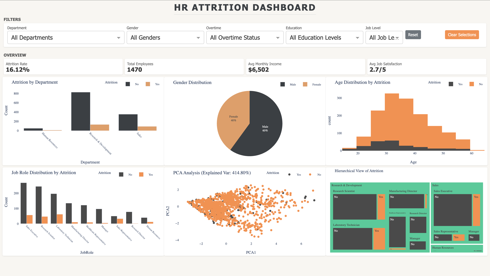

# 🧑‍💼 HR Attrition Dashboard

An interactive, responsive analytics dashboard built using **Dash**, **Plotly**, and **Pandas**, designed to explore and visualize attrition patterns in an organization's HR data. This tool helps stakeholders and HR professionals uncover key insights related to employee attrition, satisfaction, income, and workforce demographics.

---

## 📊 Demo



---

## 🚀 Features

### ✅ KPI Overview

* **Attrition Rate** — % of employees who have left.
* **Total Employees** — Count of filtered active employees.
* **Average Monthly Income** — Mean salary in the selected cohort.
* **Average Job Satisfaction** — Aggregated satisfaction score.

### 📈 Visualizations

Each graph is interactive and filterable based on selections made in others:

* **Attrition by Department (Bar Chart)**
* **Gender Distribution (Pie Chart)**
* **Age Distribution by Attrition (Histogram)**
* **Job Role Distribution by Attrition (Bar Chart)**
* **PCA Analysis (2D Projection of Employee Features)**
* **Hierarchical View of Attrition (Treemap)**

### 🎛 Filters

* Department
* Gender
* Overtime Status
* Education Level
* Job Level

### 🧠 Interactivity

* Click on bars, pie segments, and treemap areas to filter data.
* Select age ranges using drag-box on histograms.
* Click on PCA scatterplot clusters to drill down on employee groups.
* “Reset” and “Clear Selections” buttons for ease of exploration.

---

## 🧾 Dataset

The dashboard uses an HR dataset (`hr_data.csv`) with columns such as:

* `Attrition`, `Department`, `Gender`, `OverTime`, `Education`, `JobRole`, `Age`, `MonthlyIncome`, `JobSatisfaction`, etc.
* A new binary column `Attrition_Flag` is computed for analysis.

---

## 📁 Project Structure

```
VIZ/
├── Images/
│   └── Dashboard.png         # Dashboard screenshot
├── venv/                     # Virtual environment (not included in repo)
├── hr_data.csv               # Dataset
├── app.py                    # Main dashboard application
├── main.py                   # (Optional) entry-point or experiment file
```

---

## ⚙️ Setup Instructions

### 1. Clone the Repository

```bash
git clone https://github.com/Arbiter09/HR-ATTRITION-DASHBOARD.git
cd hr-attrition-dashboard
```

### 2. Create a Virtual Environment

```bash
python -m venv venv
source venv/bin/activate      # On Windows: venv\Scripts\activate
```

### 3. Install Dependencies

```bash
pip install -r requirements.txt
```

> **Note**: If `requirements.txt` is missing, manually install:

```bash
pip install dash dash-bootstrap-components pandas plotly scikit-learn
```

### 4. Add the Dataset

Place your `hr_data.csv` file in the project root. It must include relevant HR fields like `Attrition`, `Department`, etc.

### 5. Run the App

```bash
python app.py
```

Visit `http://127.0.0.1:8050` in your browser.

---

## 🧠 Insights Enabled

* Identify high-risk departments and roles for attrition.
* Compare salary and satisfaction metrics across filters.
* Use PCA projection to spot attrition-prone clusters.
* Drill down using treemaps and histograms for segment-specific trends.

---

## 🛠 Technologies Used

* **Dash**: For building the interactive web app.
* **Plotly**: For dynamic, responsive charts.
* **Pandas**: Data manipulation and preprocessing.
* **Scikit-Learn**: PCA and standardization.

---

## 💡 Use Cases

* HR Strategy & Workforce Planning
* Retention Analysis
* Compensation & Satisfaction Benchmarking
* Executive Reporting Tools

---

## 📌 To-Do / Improvements

* Add authentication layer for secure access.
* Export filtered data as CSV.
* Add time-series tracking for attrition over time.
* Deploy to a cloud platform (Heroku, Render, etc.)

---

## 📄 License

This project is licensed under the MIT License — feel free to use, modify, and distribute it.

---
